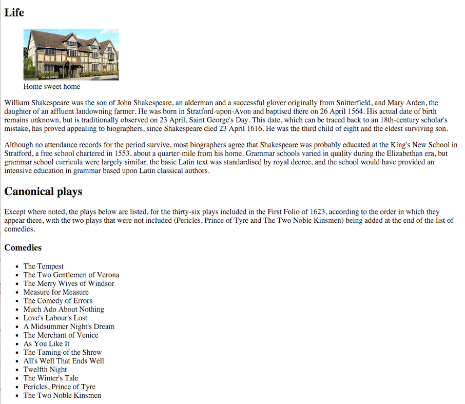

# Lab 4: Structured HTML Document
*Due: Friday, May 25, 2018 at 9:00 AM (before the next lab comes out)*

This assignment tests your ability to take "real" content and mark it up using semantically correct HTML. You will use the content you prepared from Wikipedia and fulfill the requirements as described in this document.

## 1. Setup your Work Environment

- Create your initial files: a folder named **lab04** and inside it create a new HTML document named **start.html**

- Inside the **start.html** file, setup a new HTML5 template.

- In addition to the usual HTML5 template, inside the **BODY** tags, create a set of tags that will be used as your structure. You must use the following tags in your HTML document:  **HEADER, ARTICLE, ASIDE, and FOOTER** ...exactly those, in that order.

 Here's a template you can use to get your layout elements started:

```html
<!doctype html>

<html>

<head> 
	<meta charset="utf-8">
	<title>Lab 04 – the title of your content</title>
</head>

<body>

<header>  
	<h1>the title of your content</h1>  
	<div>A subtitle</div>
</header>

<article>  
</article>

<aside>  
</aside>

<footer>
	<h2>Citations</h2>

</footer>

</body>

</html>
```
Note: In the two places where it says, "*the title of your content*" you should write the title of your content

## 2. Create the HTML Document
*This is the point of this lab*: **You must figure out how best to tag your content semantically to identify each part of content.**

Using your Wikipedia content from Lab 3, extract the text and create *at least* these following elements:

-   For use in the **HEADER**, one (and only one) **H1** (which will be the name of the topic you selected)
-   Also in the **HEADER**, create a subtitle (there is no "subtitle" tag, so use a **DIV**)
-   At least four second-level headings (**H2**s)
    -   Three of the headings go in the **ARTICLE**
    -   At least three **paragraphs** of text under each **H2** in the **ARTICLE**
    -   The last heading, with the lists, goes in the **ASIDE**
    -   Under the last heading, at least two **lists**: unordered, ordered or definition list (any combination)
-   In the **ARTICLE**, at least two images and captions for each

    -   You must wrap each **IMG** element in a **FIGURE** element (You might want to Google "HTML figure" and "HTML figcaption" to see what they're all about)

    -   Inside the **FIGURE** element along with the **IMG** you must include a **FIGCAPTION** element in which you'll write your caption for the image (You can make up the captions that will go with each image - just a couple of words that describe the image)

    -   The images must be between about 200 and 350px wide

    -   Note: the best placement for the **FIGURE** elements is right after an **H2** and before the first **P**, and do not put the **FIGURE** elements one after another - space them out
-   In the **FOOTER** put at least three citations (hypertext links to other sources)
-   Also in the **FOOTER**, another citation, referring to the Wikipedia page(s) you used in this assignment
-   Feel free to markup any of the content in the document using the **STRONG** tag and/or **EM** tag, but make sure you use them for *semantic* reasons - NOT just to make things bold or italic.  Also feel free to use other HTML tags as you see fit.  (Again, for *semantic* reasons only!)

Make sure there is *no* content between the structural tags (the **HEADER**, **ARTICLE**, **ASIDE**, and **FOOTER**).  All content must be inside those tags.

Remember: the HTML document MUST remain “semantically pure.” No tags to push content around! Generally, that means no **BR**, **HR** or extraneous **P** tags anywhere, and definitely no **B** or **I** tags.

Take a look at the [EXAMPLE](#example) at the end of this document. When you’re done, you should have a document that kinda looks like that but with different content.

## 3. Upload your work
When you are done with your webpage, use an FTP tool to access your account on **urcsc170.org** (remember your FTP login information?) and upload your files into a new folder named **lab04**

In a web browser (any), go to this address to check your handiwork:  
**www.urcsc170.org/accountname/lab04/start.html** (where “*accountname*” is your account name)

Remember: All files and folder names must always be all lowercase and no spaces.

## 4. Report your work

Remember: Use the W3C validator ([validator.w3.org](https://validator.w3.org)) to check your work before you report it!

-   In our Blackboard section, in Lab 04, create a new submission and post a link to your webpage to receive credit for this Lab.

## Example

NOTE: Do *not* use Shakespeare for your Lab 4!



