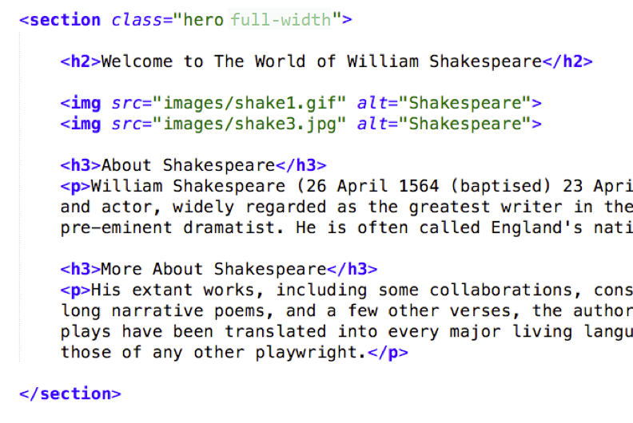

# CSC 170 Lab 15: JavaScript Plugins
*Due: Friday, June 22, 2018*

The goal of this lab assignment is to rip-out the simple JavaScript solutions you used on the homepage of your website and replace them with more elegant, jQuery-powered plugins.

You will need to be familiar with these two plugins:

- Super Simple Slider ([supersimpleslider.com](http://supersimpleslider.com))
- jQuery UI ([jqueryui.com](http://jqueryui.com)) ...nothing for you to download here. We'll use CDNs for this plugin. Just follow the instructions below.


## Setup

- Make a copy of your **lab14** folder.  Call it **lab15**

- In the PHP Include file where you keep the HEAD, change the TITLE in the HEAD  to "Lab 15 - ..."  e.g.  `<title>Lab 15 - Shakespeare</title>` 

- In the **index.php** file rip out the "hover trick" JavaScript you used from Lab 14 by doing this...

	- Take the IMG element out of its FIGURE element - delete the FIGURE and FIGCAPTION elements.  Just leave the IMG under the "Welcome..." H2, by itself.
	- Remove the *onmouseover=""* and *onmouseout=""* attributes from the IMG
	- Create a second IMG element, right under the first, that points to your other image.  (The one you used for your *onmouseover*.)

- Rip out the "More..." JavaScript you used from Lab 13
	-	Remove the IDs you used to toggle the content
			Delete the BUTTON element between your two DIVs
			Delete the DIVs around your content (leave the content)
			In the file system, delete the folder and file: **js/scripts.js**
			In the index file, delete the script link to the **js/scripts.js** file

You'll end up with something that looks like this:


## Install Super Simple Slider
You need to install the plugin according to the instructions by the author.  In all, you need to do the following:
- Add the **sss** folder as-is to the **lab15** folder (Obtain the SSS folder from the author's website)

- In the PHP Include file where you keep the HEAD, in the correct location add a link to the **sss/sss.css** file
  `<link rel="stylesheet" href="sss/sss.css">`

- In the **index** file wrap your IMGs in a new DIV with a `class="slider"`

- In the **index** file, in the correct location install the jQuery CDN (from Google)
  `<script src="http://ajax.googleapis.com/ajax/libs/jquery/1.9.0/jquery.min.js"></script>`

- In the **index** file, in the correct location install the SSS plugin `<script src="sss/sss.min.js"></script>`

- In the **index** file, in the correct location install an initialization string for the SSS plugin

  ```html
  <script>
  $('.slider').sss();
  </script>
  ```

## Install jQuery UI's Accordion Plugin
You need to install the plugin according to the instructions by the developers of jQuery UI.  In all, you need to do the following:

- NOTE: you must *not* re-install jQuery!  (You already installed it when you added SSS.)
- In the **index** file, in the correct location install the plugin script using a CDN that hosts the jQuery UI script

	```html
	<script src="http://code.jquery.com/ui/1.11.4/jquery-ui.js"></script>
	```

- In the **index** file, in the correct location install an initialization string for the jQuery UI plugin

	```html
	<script>
	$( "#accordion" ).accordion({
		heightStyle: "content"
	});
	</script>
	```

- In the PHP Include file where you keep the HEAD, install the CSS using the CDN that hosts the jQuery UI styles
`<link rel="stylesheet" href="http://code.jquery.com/ui/1.11.4/themes/smoothness/jquery-ui.css">`

- Wrap your content (a couple of headers and some paragraphs) in a new DIV with an `id="accordion"`

You should end up with something that looks like this:


OPTIONALLY: go into your **home.css** file and change/add styles as you see fit to make the "hero" look nicer.  E.g. add `grid-gap: 25px;` to the `.hero` styles.  It's up to you.

## Check and Upload your Work
- Validate the HTML file ([http://validator.w3.org/](http://validator.w3.org/))

When you are done with your webpage, close everything and use an FTP tool (to access your account on **csc170.org** and upload your files:

- In a web browser (any), go to this address to check your handiwork: 
	```www.csc170.org/accountname/lab15/index.php```<br>
	(where *accountname* is your account name)

## Report your work
•	In our Blackboard section, in **Lab 15**, post a link to your webpage to receive credit for this Lab. 
